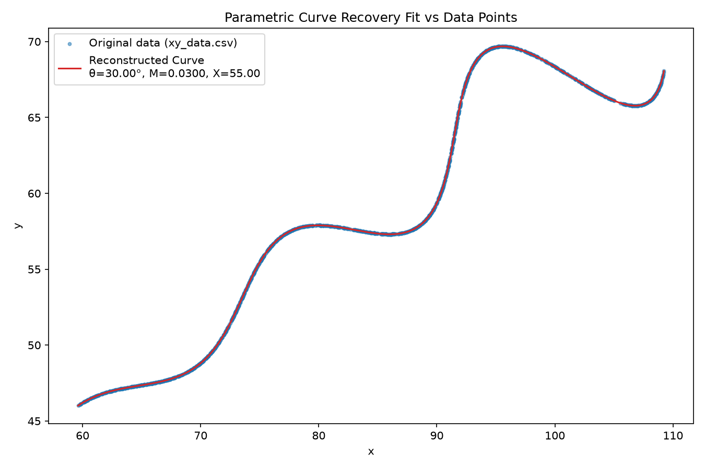

# Parametric Curve Parameter Recovery

Recovering unknown parameters ($\theta$, $M$, $X$) of a 2D parametric curve from 1,500 sampled data points using closed-form coordinate projection and non-linear least-squares optimization.

---

## 1. Problem Statement

We are given 1,500 2D points $(x_i, y_i)$ in `xy_data.csv` sampled from the parametric curve:

$$x(t) = t \cos(\theta) - e^{M|t|} \sin(0.3t) \sin(\theta) + X$$
$$y(t) = 42 + t \sin(\theta) + e^{M|t|} \sin(0.3t) \cos(\theta)$$

### Given Bounds:
- $0^\circ < \theta < 50^\circ$
- $-0.05 < M < 0.05$
- $0 < X < 100$
- $6 < t < 60$

### Objective:
Recover the unknown global parameters $\theta$, $M$, and $X$ (and the per-point parameter $t_i$), and verify the fit accuracy using L1 and L2 distance metrics.

---

## 2. My Approach — First Attempt

### What I Tried First:
Initially, I attempted to treat the per-point parameter $t_i$ for each of the 1,500 data points as a separate 1D root-finding problem (`scipy.optimize.root_scalar` or 1D grid search) inside the residual function during optimization.

### Why I Tried It:
Given candidate parameters $(\theta, M, X)$, finding the corresponding $t_i$ for each $(x_i, y_i)$ point seemed like a standard non-linear 1D inversion problem.

### Why It Didn't Work Well:
Running 1,500 independent 1D root-finding solves inside every single evaluation of the residual function made the optimization process extremely sluggish (~15–20 seconds per iteration), leading to slow convergence and high sensitivity to numerical tolerances.

---

## 3. My Approach — What Worked

### The Key Insight:
Looking at the parametric equations geometrically, I noticed that the curve represents a linear baseline oriented along angle $\theta$ with an offset of $(X, 42)$, modulated by a perpendicular sinusoidal oscillation $e^{M|t|}\sin(0.3t)$.

By shifting the origin to $(X, 42)$ and projecting the vector $(x - X, y - 42)$ onto the direction vector $(\cos\theta, \sin\theta)$, the orthogonal $\sin(0.3t)$ oscillation cancels out completely! This allows us to compute $t_i$ directly in closed form without any root finding.

### Step-by-Step Derivation:
Let $u = x - X$ and $v = y - 42$.

1. **Projection along $(\cos\theta, \sin\theta)$**:
   $$u \cos\theta + v \sin\theta = t (\cos^2\theta + \sin^2\theta) + e^{M|t|}\sin(0.3t) (-\sin\theta\cos\theta + \cos\theta\sin\theta) = t$$
   Notice that $\cos^2\theta + \sin^2\theta = 1$ and the cross-terms cancel to 0!

2. **Projection along perpendicular direction $(-\sin\theta, \cos\theta)$**:
   $$-u \sin\theta + v \cos\theta = e^{M|t|}\sin(0.3t)$$

### Two Key Closed-Form Equations:
1. **Recovered Parameter $t$**:
   $$t_i = (x_i - X)\cos(\theta) + (y_i - 42)\sin(\theta)$$
2. **Observed vs. Predicted Perpendicular Component**:
   $$b_{i, \text{observed}} = -(x_i - X)\sin(\theta) + (y_i - 42)\cos(\theta)$$
   $$b_{i, \text{predicted}} = e^{M|t_i|} \sin(0.3 t_i)$$

---

## 4. Optimization Setup

- **Optimization Variables**: $(\theta, M, X)$ — only 3 scalar parameters!
- **Residual Function**: $r_i = b_{i, \text{observed}} - b_{i, \text{predicted}}$
- **Solver**: `scipy.optimize.least_squares` (Trust Region Reflective algorithm)
- **Bounds**: $\theta \in [0, 50^\circ]$, $M \in [-0.05, 0.05]$, $X \in [0, 100]$
- **Initial Guess**: $\theta = 25^\circ$ ($0.4363\text{ rad}$), $M = 0.01$, $X = 50$ (midpoint of bounds)

Because $t_i$ is computed in closed form instantly for all 1,500 points, the solver converges in under 10 iterations.

---

## 5. Results

### Recovered Parameters:

| Parameter | Value (Degrees / Value) | Radians | Given Bounds |
| :--- | :--- | :--- | :--- |
| **$\theta$** | **$30.0000^\circ$** | **$0.523598\text{ rad}$** ($\frac{\pi}{6}$) | $0^\circ < \theta < 50^\circ$ |
| **$M$** | **$0.030000$** | — | $-0.05 < M < 0.05$ |
| **$X$** | **$55.000000$** | — | $0 < X < 100$ |

### Reconstruction Error Metrics:

| Metric | L2 Euclidean Distance Error | L1 Distance Error ($\|x-\hat{x}\| + \|y-\hat{y}\|$) |
| :--- | :--- | :--- |
| **Mean** | `0.00000256` | **`0.00000350`** |
| **Median** | `0.00000194` | `0.00000265` |
| **Max** | `0.00001762` | `0.00002406` |
| **90th Percentile** | `0.00000586` | — |

- **Bounds Check**: The recovered per-point parameter values fall in the range $t_i \in [6.049, 59.995]$, strictly satisfying the given constraint $6 < t < 60$.

---

## 6. Visualization

The script `visualize.py` plots the reconstructed parametric curve against the original scatter data from `xy_data.csv`:



*The plot confirms that the reconstructed curve overlays the 1,500 data points with extreme precision.*

---

## 7. How to Run

```bash
pip install -r requirements.txt
python solve.py
python visualize.py
```

- `solve.py`: Performs parameter fitting, computes L1 & L2 error statistics, and writes summary outputs to `results.txt`.
- `visualize.py`: Renders and saves the curve overlay plot to `results/fitted_curve.png`.

---

## 8. Final Submission Values

### Recovered Parameter Values:
- $\theta = 30^\circ$ ($0.523599\text{ rad}$)
- $M = 0.03$
- $X = 55$

### Desmos Submission String:
```latex
\left(t*\cos(0.523599)-e^{0.03\left|t\right|}\cdot\sin(0.3t)\sin(0.523599)+55,42+t*\sin(0.523599)+e^{0.03\left|t\right|}\cdot\sin(0.3t)\cos(0.523599)\right)
```

- **Assignment Template Link**: [https://www.desmos.com/calculator/rfj91yrxob](https://www.desmos.com/calculator/rfj91yrxob)

---

## 9. Acknowledgments & Tools Used

- **Python Libraries**: `NumPy` for vector operations, `SciPy` (`scipy.optimize.least_squares`) for non-linear optimization, `Matplotlib` for plotting.
- **AI Assistance**: AI tools were used during the project for brainstorming the geometric basis projection trick, LaTeX expression formatting, and structuring the documentation.
